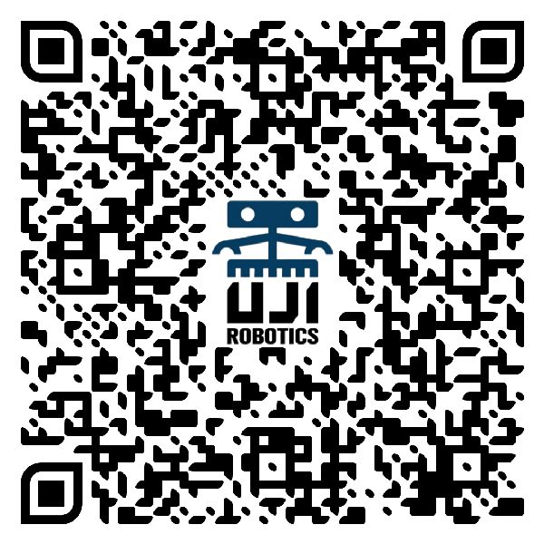

<!-- Cuando tengáis el logo, guardadlo como assets/logo.png y descomentad la línea siguiente:

-->

# UJI Robotics Team

**Equipo universitario de robótica de la Universitat Jaume I**

*Diseñamos, construimos y programamos robots desde cero — y enseñamos a hacerlo.*

 

[][inscripcion]

[Proyectos](#-proyectos) · [Tecnologías](#-tecnologías) · [Áreas](#-áreas-de-trabajo) · [Formación](#-formación) · [Únete](#-únete-al-equipo) · [Contacto](#-contacto)

---

## 👋 Quiénes somos

**UJI Robotics Team** es el equipo de robótica de la **Universitat Jaume I** (Castellón de la Plana).
Lo formamos principalmente estudiantes del grado en **Inteligencia Robótica**, junto con compañeros y
compañeras de Ingeniería Mecánica, Video Juegos y otros grados, con el apoyo de
**profesorado de la UJI** que actúa como mentor de cada proyecto.

Nos organizamos de la manera más parecida a un equipo real de ingeniería: cada proyecto tiene sus **áreas**, sus **responsables**, 
su **presupuesto** y sus **propositos**. 

> **Nuestro objetivo:** formar un equipo de gente aficionada a la robotica,
> y formar les venga con la experiencia que venga para que acaben sabiendo
> cómo se construye un robot completo

---

## 🚀 Proyectos

### 🪐 IBERUS — European Rover Challenge

Nuestro proyecto insignia: un **rover marciano** completo diseñado y fabricado por el equipo para el
[European Rover Challenge](https://roverchallenge.eu), una de las competiciones de robótica espacial
más importantes de Europa. IBERUS debe navegar terreno no estructurado, recoger muestras de
superficie y profundidad, manipular paneles de control y operar en modo autónomo.

<table>
<tr><td width="50%" valign="top">

**Plataforma**
- Chasis con suspensión *rocker-bogie*
- **38,5 kg** en configuración máxima *(límite: 75 kg)*
- Batería LiFePO₄ 12,8 V · 50 Ah con BMS
- PCB de distribución de potencia de diseño propio
- Actuadores Dynamixel (XM540 / XL430 / XL330)
- Brazo manipulador + módulo de ciencia con taladro
- Dron de apoyo con aterrizaje autónomo de emergencia

</td><td width="50%" valign="top">

**Software y percepción**
- **ROS 2** — arquitectura modular por nodos
- Navegación con **Nav2** + SLAM
- LiDAR Unitree L1 (4D) y LiDAR 2D
- Cámaras RealSense D435, ZED 2i y gimbal SIYI A2
- Detección de marcadores **ArUco** (fiable hasta 7 m)
- Cómputo a bordo: **NVIDIA Jetson Orin Nano**
- Simulación en **Gazebo** + estación de control en **Unity**
- Enlace de radio Ubiquiti hasta 100 m

</td></tr>
</table>

### 🏁 ASTI Robotics Challenge

Competición nacional de robótica móvil con final en Burgos. Presentamos **dos equipos** en la
edición 2026, lo que convierte al proyecto en nuestra mejor puerta de entrada para estudiantes de
primeros cursos: robots pequeños, ciclo de desarrollo corto y resultados visibles en pocos meses.

- **Pruebas:** siguelíneas, sumo, laberinto, minifábrica y reto final de proyecto.
- **Electrónica:** microcontrolador **ESP32-P4-ETH** (con Ethernet para comunicar con la Raspberry Pi), drivers de motor, encoders y sensores IR.
- **Software:** **ROS 2** sobre Raspberry Pi, odometría por encoders, SLAM con LiDAR, visión por computador y control **PID**.
- **Mecánica:** diseño 3D propio e impresión de todas las piezas.
- **Extras:** telemetría de batería, CPU y temperatura.

*Ediciones: 2023 · 2024 · 2026*

 

### ⛵ Catamarán Reciplasa

Embarcación robótica no tripulada desarrollada en colaboración con **Reciplasa**.

- Casco propio y acoples de motor impresos en 3D.
- Control de propulsión con **ROS 2** sobre Raspberry Pi.
- Teleoperación mediante **joystick**.
- Estudio de materiales aislantes y análisis de alternativas de motorización.

Un proyecto especialmente formativo: el equipo aprendió ROS 2 desde cero, apoyándose en estudiantes
de cursos superiores y en documentación abierta, hasta conseguir mover los motores del catamarán.

---

## 🧰 Tecnologías

| Dominio | Herramientas |
|---|---|
| **Middleware y navegación** | ROS 2, Nav2, `ros2_control`, SLAM, `tf` |
| **Percepción** | OpenCV, ArUco, LiDAR (Unitree L1, 2D), RealSense D435, ZED 2i |
| **Simulación** | Gazebo, simulador oficial del ERC |
| **Interfaces** | Unity (estación de control), GUI de telemetría |
| **Cómputo embebido** | NVIDIA Jetson Orin Nano, Raspberry Pi, ESP32 / ESP32-P4-ETH |
| **Electrónica** | EasyEDA, diseño de PCB, distribución de potencia, DC-DC, Dynamixel |
| **Mecánica** | Diseño CAD, impresión 3D (Bambu Studio), reductoras y acoples propios |

---

## 🧩 Áreas de trabajo

Cada proyecto se estructura en áreas con responsable propio. Puedes unirte a la que más te interese
— o rotar entre varias hasta encontrar la tuya.

| Área | De qué se encarga |
|---|---|
| ⚙️ **Mecánica** | Chasis, suspensión, transmisión, brazos, diseño CAD e impresión 3D |
| 🔌 **Electrónica** | Esquemas, PCB, distribución de potencia, sensores y actuadores |
| 💻 **Software** | ROS 2, navegación, control, integración de sensores, autonomía |
| 👁️ **Percepción y visión** | Cámaras, LiDAR, SLAM, detección de marcadores y obstáculos |
| 🖥️ **Interfaz y GUI** | Estación de control, telemetría, experiencia de operador |
| 📡 **Comunicaciones** | Enlaces de radio, antenas, redes a bordo |
| 🚁 **Dron** | Plataforma aérea de apoyo y protocolos de seguridad |
| 📋 **Gestión** | Presupuestos, documentación, plazos, patrocinios y difusión |

---

## 🤝 Únete al equipo

**No necesitas experiencia previa.** Necesitas ganas de construir cosas y de aprender con otra gente.
Entramos gente de todas las titulaciones: si te interesa la mecánica, la electrónica, la programación, 
el diseño o incluso la gestión y la comunicación, hay sitio para ti.

**Escanea el código o pulsa el botón para inscribirte**

[][inscripcion]

---

## 📫 Contacto

[][email]
[][instagram]
[][youtube]
[][web]

### ¿Quieres patrocinarnos?

Competir fuera de casa cuesta dinero: componentes, fabricación, transporte e inscripciones. Si tu
empresa quiere apoyar a un equipo universitario que construye robots de verdad y forma a los
ingenieros e ingenieras que vienen, **escríbenos**. Buscamos tanto apoyo económico como donación de
material y asesoramiento técnico.

---

**Universitat Jaume I** · Castellón de la Plana, España

*Hecho con ☕, impresora 3D y muchas horas de laboratorio.*

[inscripcion]: https://docs.google.com/forms/d/e/1FAIpQLSfMQ1xXIOoUNSdNkyuq0fGHkp5CRMgmVPc6sXZAkZQ36_eAig/viewform
[email]: mailto:ujiroboticsteam@gmail.com
[instagram]: https://www.instagram.com/ujirobotics/
[youtube]: https://www.youtube.com/@ujirobotics
[web]: https://ujirobotics.wixsite.com/ujiroboticsteam
